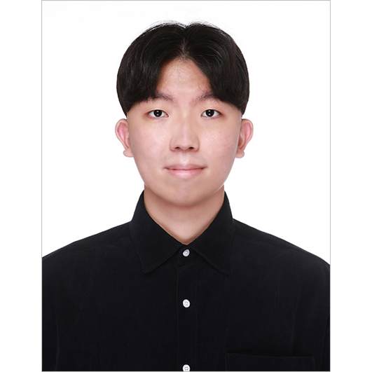

## About Me

- MS/Ph.D student in the Department of Computer Science and Engineering at Korea University. (Advisor: Prof. <a href="https://scholar.google.co.kr/citations?user=HMTkz7oAAAAJ&amp;hl=ko&amp;oi=ao">Heuiseok Lim</a>)

- Researcher of <a href="http://nlp.korea.ac.kr/">NLP & AI Lab</a>
- Co-founder of <a href="http://kunmt.org/">KU-NMT Group</a>. 
- Google Scholar: [Link](https://scholar.google.com/citations?user=queGQ5UAAAAJ&hl=ko)
 <!-- This is a jekyll based resume template. You can find the full source code on [GitHub] --> 
 <!-- (https://github.com/bk2dcradle/researcher) -->

## Research Interest
Neural Machine Translation, Language Resource and Evaluation, Data-Centric NMT

## Affiliation
2021.03 - Now: Korea University Ph.D. Student of Computer Science  
2015.03 - 2021.02: Korea University B.S degree of Mathematics & Artificial Intelligence

<!-- 
## Academic Services
Virtual Social Chair: COLING 2022  
Program committee (Reviewer): ACL 2022, ACL 2022-Insights, NAACL 2022, NAACL 2022-Industry Track    -->

## Publications
<!-- ### Preprints  -->
<!-- 1. [Empirical study on BlenderBot 2.0’s Errors Analysis in terms of Model, Data and User-Centric Approach](https://arxiv.org/abs/2201.03239)  
Jungseob Lee, Suhyune Son, Midan Shim, Yujin Kim, **Chanjun Park**, Heuiseok Lim **(Equal Contribution(First Co-Author))**  
*arxiv, 2022* 

2. [A Self-Supervised Automatic Post-Editing Data Generation Tool](https://arxiv.org/abs/2111.12284)  
Hyeonseok Moon, **Chanjun Park**, Sugyeong Eo, Jaehyung Seo, SeungJun Lee, Heuiseok Lim  
*arxiv, 2021* 

3. [Empirical Analysis of Korean Public AI Hub Parallel Corpora and in-depth Analysis using LIWC](https://arxiv.org/abs/2110.15023)  
**Chanjun Park**, Midan Shim, Sugyeong Eo, Seolhwa Lee, Jaehyung Seo, Hyeonseok Moon, Heuiseok Lim  
*arxiv, 2021* 

4. [PicTalky: Augmentative and Alternative Communication Software for Language Developmental Disabilities](https://arxiv.org/abs/2109.12941)  
**Chanjun Park**, Yoonna Jang, Seolhwa Lee, Jaehyung Seo, Kisu Yang, Heuiseok Lim 
*arxiv, 2021*  -->

### Top Conference (Main / Workshop)
- [QUAK: A Synthetic Quality Estimation Dataset for Korean-English Neural Machine Translation](https://aclanthology.org/2022.coling-1.460/)  
Sugyeong Eo, Chanjun Park, **Hyeonseok Moon**, Jaehyung Seo, Gyeongmin Kim, Jungseob Lee, Heuiseok Lim  
*COLING 2022, - (Poster), 2022* 

- [Focus on FoCus: Is FoCus focused on Context, Knowledge and Persona?](https://aclanthology.org/2022.ccgpk-1.1/)  
SeungYoon Lee, Jungseob Lee, Chanjun Park, Sugyeong Eo, **Hyeonseok Moon**, Jaehyung Seo, Jeongbae Park, Heuiseok Lim  
*COLING 2022, - Workshop on Customized Chat Grounding Persona and Knowledge, 2022* 

- [A Dog Is Passing Over The Jet? A Text-Generation Dataset for Korean Commonsense Reasoning and Evaluation](https://aclanthology.org/2022.findings-naacl.172/)  
Jaehyung Seo, Seounghoon Lee, Chanjun Park, Yoonna Jang, **Hyeonseok Moon**, Sugyeong Eo, Seonmin Koo, Heuiseok Lim  
*NAACL 2022 - Findings, 2022* 

- [A Self-Supervised Automatic Post-Editing Data Generation Tool](https://arxiv.org/abs/2111.12284)  
**Hyeonseok Moon**, Chanjun Park, Sugyeong Eo, Jaehyung Seo, SeungJun Lee, Heuiseok Lim  
*ICML 2022 - DataPerf AI (DCAI) workshop, 2022* 

- [Empirical Analysis of Synthetic Data Generation Using Noising Strategies for Automatic Post-editing](https://aclanthology.org/2022.lrec-1.93/)  
**Hyeonseok Moon**, Chanjun Park, Seolhwa Lee, Jaehyung Seo, Jeongsub Lee, Sugyeong Eo, Heuiseok Lim  
*LREC 2022 - (Poster), 2022* 

- [Priming Ancient Korean Neural Machine Translation](https://aclanthology.org/2022.lrec-1.3/)  
Chanjun Park, Seolhwa Lee, **Hyeonseok Moon**, Sugyeong Eo, Jaehyung Seo, Heuiseok Lim  
*LREC 2022 - (Oral presentation), 2022* 

- [How should human translation coexist with NMT? Efficient tool for building high quality parallel corpus](https://arxiv.org/abs/2111.00191)  
Chanjun Park, Seolhwa Lee, **Hyeonseok Moon**, Sugyeong Eo, Jaehyung Seo, Heuiseok Lim  
*NeurIPS 2021 - Data-centric AI (DCAI) workshop, 2021* 

- [A New Tool for Efficiently Generating Quality Estimation Datasets](https://arxiv.org/abs/2111.00767)  
Sugyeong Eo, Chanjun Park, Jaehyung Seo, **Hyeonseok Moon**, Heuiseok Lim  
*NeurIPS 2021 - Data-centric AI (DCAI) workshop, 2021* 

- [Automatic Knowledge Augmentation for Generative Commonsense Reasoning](https://arxiv.org/abs/2111.00192)  
Jaehyung Seo, Chanjun Park, Sugyeong Eo, **Hyeonseok Moon**, Heuiseok Lim  
*NeurIPS 2021 - Data-centric AI (DCAI) workshop, 2021* 

- [BTS: Back TranScription for Speech-to-Text Post-Processor using Text-to-Speech-to-Text](https://aclanthology.org/2021.wat-1.10/) 
Chanjun Park, Jaehyung Seo, Seolhwa Lee, Chanhee Lee, **Hyeonseok Moon**, Sugyeong Eo, Heuiseok Lim 
*ACL 2021 -WAT(Workshop on Asian Translation) 2021 Workshop, 2021 - (oral presentation)* 

- [Dealing with the Paradox of Quality Estimation](https://aclanthology.org/2021.mtsummit-LoResMT.1/)  
Sugyeong Eo, Chanjun Park, Jaehyung Seo, **Hyeonseok Moon**, Heuiseok Lim **(Equal Contribution(First Co-Author))**  
*MT Summit 2021 - LoResMT, 2021 - (Oral presentation)* 

- [Should we find another model?: Improving Neural Machine Translation Performance with ONE-Piece Tokenization Method without Model Modification](https://aclanthology.org/2021.naacl-industry.13/) 
**Chanjun Park**, Sugyeong Eo, **Hyeonseok Moon**, Heuiseok Lim 
*NAACL-HLT 2021 Industry Track, 2021- (Poster/Oral presentation)* 

### International Journal (SCI/SCIE)

- [PU-GEN: Enhancing generative commonsense reasoning for language models with human-centered knowledge](https://www.sciencedirect.com/science/article/abs/pii/S0950705122009546)  
Jaehyung Seo, Dongsuk Oh, Sugyeong Eo, Chanjun Park, Kisu Yang, **Hyeonseok Moon**, Kinam Park, Heuiseok Lim  
*Knowledge-Based Systems (KBS), 2022* 

- [Plain Template Insertion: Korean-Prompt-Based Engineering for Few-Shot Learners](https://ieeexplore.ieee.org/abstract/document/9913979)  
Jaehyung Seo, **Hyeonseok Moon**, Chanhee Lee, Sugyeong Eo, Chanjun Park, Jihoon Kim, Changwoo Chun, Heuiseok Lim  
*IEEE Access, 2022* 

- [BERTOEIC: Solving TOEIC Problems Using Simple and Efficient Data Augmentation Techniques with Pretrained Transformer Encoders](https://www.mdpi.com/2076-3417/12/13/6686)  
Jeongwoo Lee, **Hyeonseok Moon**, Chanjun Park, Jaehyung Seo, Sugyeong Eo, Heuiseok Lim  
*Applied Sciences, 2022* 

- [AI for Patents: A Novel Yet Effective and Efficient Framework for Patent Analysis](https://ieeexplore.ieee.org/abstract/document/9779775)  
Junyoung Son, **Hyeonseok Moon**, Jeongwoo Lee, Seolhwa Lee, Chanjun Park, Wonkyung Jung, Heuiseok Lim  
*IEEE Access, 2022* 

- [Return on Advertising Spend Prediction with Task Decomposition-Based LSTM Model](https://www.mdpi.com/2227-7390/10/10/1637)  
**Hyeonseok Moon**, Taemin Lee, Jaehyung Seo, Chanjun Park, Sugyeong Eo, Imatitikua D Aiyanyo, Jeongbae Park, Aram So, Kyoungwha Ok, Kinam Park  
*Mathematics, 2022* 

- [Word-level Quality Estimation for Korean-English Neural Machine Translation](https://ieeexplore.ieee.org/document/9761258)  
Sugyeong Eo, Chanjun Park, **Hyeonseok Moon**, Jaehyung Seo, Heuiseok Lim  
*IEEE Access, 2022* 

- [Dense-to-Question and Sparse-to-Answer: Hybrid Retriever System for Industrial Frequently Asked Questions](https://www.mdpi.com/2227-7390/10/8/1335)  
Jaehyung Seo, Taemin Lee, **Hyeonseok Moon**, Chanjun Park, Sugyeong Eo, Imatitikua D AIyanyo, Kinam Park, Aram So, Sungmin Ahn, Jeongbae Park  
*Mathematics, 2022*  

- [Mimicking Infants’ Bilingual Language Acquisition for Domain Specialized Neural Machine Translation](https://ieeexplore.ieee.org/document/9751075) 
Chanjun Park, Woo-Young Go, Sugyeong Eo, **Hyeonseok Moon**, Seolhwa Lee, Heuiseok Lim  
*IEEE Access, 2022* 

- [An Automatic Post Editing with Efficient and Simple Data Generation Method](https://ieeexplore.ieee.org/document/9714400) 
**Hyeonseok Moon**, Chanjun Park, Jaehyung Seo, Sugyeong Eo, Heuiseok Lim  
*IEEE Access, 2022* 

- [An Empirical Study on Automatic Post Editing for Neural Machine Translation](https://ieeexplore.ieee.org/document/9528385)  
**Hyeonseok Moon**, Chanjun Park, Sugyeong Eo, Jaehyung Seo, Heuiseok Lim  
*IEEE Access, 2021* 

- [Comparative Analysis of Current Approaches to Quality Estimation for Neural Machine Translation](https://www.mdpi.com/2076-3417/11/14/6584) 
Sugyeong Eo, Chanjun Park, **Hyeonseok Moon**, Jaehyung Seo, Heuiseok Lim  
*Applied Sciences, 2021* 

<!-- ### International & Domestic Conference
Domestic Journal (KCI): 20 papers, Domestic Conference: 32 papers, International Conference: 23 papers -->

<!-- ### Book Chapters
1. [Natural Langugae Processing Bible](https://www.aladin.co.kr/shop/wproduct.aspx?partner=rss&ISBN=K412637214) 
HeuiSeok Lim, **Korea University NLP&AI Lab**  
*Human Science* -->

<!-- ### International Patents -->
<!-- 1. METHOD OF BUILDING TRAINING DATA OF MACHINE TRANSLATION  
HeuiSeok Lim, **Chanjun Park**  -->

<!-- ### Domestic Patents -->
<!-- 1. DEVICE AND METHOD FOR GENERATING OF TRAINING DATA FOR QUALITY ESTIMATION IN MACHINE TRANSLATION  
HeuiSeok Lim, Sugyeong Eo, **Chanjun Park**, Hyeonseok Moon  

2. APPRATUS FOR CORPUS PROCESSING, APPARATUS AND METHOD AND MATHINE TRANSLATION  
**Chanjun Park**, HeuiSeok Lim  

3. DEVICE AND METHOD FOR GENERATING TRAINING DATA FOR AUTOMATIC POST EDITING  
HeuiSeok Lim, Hyeonseok Moon, **Chanjun Park**, Sugyeong Eo  

4. DEVICE AND METHOD FOR GENERATING OPTIMAL TRANSLATION SUBTITLE USING QUALITY ESTIMATION  
HeuiSeok Lim, **Chanjun Park**  

5. Improving speech recognition performance using TTS in domain-specific environment  
HeuiSeok Lim, **Chanjun Park**  

6. Method For Generating Training Data And Method For Post-Processing Of Speech Recognition Using The Same  
HeuiSeok Lim, **Chanjun Park**  

7. METHOD OF BUILDING TRAINING DATA OF MACHINE TRANSLATION  
HeuiSeok Lim, **Chanjun Park**  

8. Correction performance evaluation metrics of neural network machine translation and method of constructing the same  
HeuiSeok Lim, **Chanjun Park**  

9. APPARATUS AND METHOD FOR OUTPUTTING IMAGE CORRESPONDING TO LANGUAGE  
HeuiSeok Lim, **Chanjun Park**, Yanghee Kim  

10. METHOD OF TRANSLATING ANCIENT KOREAN USING MACHINE TRANSLATION  
HeuiSeok Lim, **Chanjun Park**  

11. Device and method for correcting Korean spelling  
HeuiSeok Lim, **Chanjun Park**   -->

<!-- ## Teaching -->
<!-- 1. [Introduction to Natural Language Processing in Big Data (BDC101)](https://github.com/Parkchanjun/KU-NLP-2020-1), Teaching Assistant, Korea Univ. (Autumn 2021)  
2. [Introduction to Natural Language Processing in Big Data (BDC101)](https://github.com/Parkchanjun/KU-NLP-2020-1), Head Teaching Assistant, Korea Univ. (Autumn 2020)  
3. [Natural Language Processing for Digital Finance Engineering (DFE610)](https://github.com/Parkchanjun/KU-NLP-2020-1), Head Teaching Assistant, Korea Univ. (Autumn 2020)  
4. [Natural Language Processing (COSE461)](https://github.com/Parkchanjun/KU-NLP-2020-1), Teaching Assistant, Korea Univ. (Spring 2020)  
5. [Artificial Intelligence and Natural Language Processing (DFC615)](https://github.com/Parkchanjun/KU-NLP-2020-1), Teaching Assistant, Korea Univ. (Spring 2020)   -->

<!-- ## Honors & Awards

Year | Award
:-----:|-------
2021.12 | Naver Ph.D. Fellowship 2021
2021.10 | Best Paper Award, The 33rd Annual Conference on Human & Cognitive Language Technology (HCLT2021) - NLP Application 2 Section
2021.10 | Best Paper Award, The 33rd Annual Conference on Human & Cognitive Language Technology (HCLT2021) - Language Resource Section
2021.10 | Best Paper Award, The 33rd Annual Conference on Human & Cognitive Language Technology (HCLT2021) - QA and Speech Section
2020.11 | [1st Place in Flitto Hackathon (Team Lead)](https://www.flitto.com/business/blog/6547023368438992855?country=ko)
2020.10 | Best Paper Award, The 32nd Annual Conference on Human & Cognitive Language Technology (HCLT2020)
2020.05 | [Best practices for using NIA AI training data(Korean-English Neural Machine Translation model)](http://aihub.or.kr/node/4525), NIA
2019.10 | Best Paper Award, The 31st Annual Conference on Human & Cognitive Language Technology (HCLT2019)  
2019.10 | [1st Place Microsoft AI Accessibility Hackathon in Korea (Team Lead)](http://hiai.co.kr/news/?uid=52&mod=document), Microsoft
2019.03 | Graduate School Associate Scholarship, Sungkyunkwan University
2018.10 | [Next Generation Information Processing NLP Competition 2018: Participation Award](https://sites.google.com/site/koreanlp2018/), Next-generation information computing technology development business
2017.06 | Bit Computer Excellence Award (President Award), Bit Computer
2017.12 | Scholarship for academic excellence, Sooyoungro Church
2016.12 | Scholarship for academic excellence, Sooyoungro Church
2015.03 | Full Scholarship, BUFS -->

<!-- ## Invited Talk

Year | Place | Contents
:-----:|-------|-------
2022.01 | Dongguk University |  Artificial intelligence and Machine Translation
2021.07 | Busan Social Welfare Development Group |  Attending advisory meetings and Focus Group Interview
2020.03 | LLsoLLu |  Latest natural language processing Research
2020.02 | NC SOFT |  Technology Transfer Seminar
2020.01 | Dongguk University |  [A.I - NLP - MT for Liberal Arts](https://github.com/Parkchanjun/Dongguk_AI_NLP_MachineTranslation)
2019.10-2019.11 | SKC  |  [Text Preprocessing, Machine Translation, Language Embedding](https://github.com/Parkchanjun/SKC_MachineTranslation)
2019.08 | SK T Academy  |  [Machine Translation for everyone](https://www.youtube.com/watch?v=3WvA-sFiI6w&list=PL9mhQYIlKEhcyCTvJq6tGJ3_B6hRjLm2N)
2019.08 | NAVER |  [Machine Translation for everyone](https://tv.naver.com/v/9906991) -->

   
